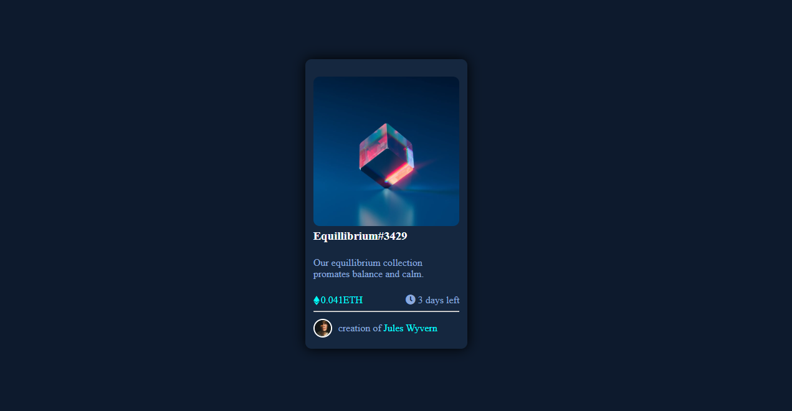

# nftPreviewCardComponent
# Frontend Mentor - NFT preview card component solution

This is a solution to the [NFT preview card component challenge on Frontend Mentor](https://www.frontendmentor.io/challenges/nft-preview-card-component-SbdUL_w0U). Frontend Mentor challenges help you improve your coding skills by building realistic projects. 

## Table of contents
-[Screenshot](#screenshot)
-[Links](#links)
-[Built with](#built-with)
-[What I learned](#what-i-learned)
-[Author](#author)

### Screenshot

### Links
- Solution URL : https://github.com/builtbymort/nftPreviewCardComponent
- Live Site URL : https://builtbymort-nftPreviewCardComponent.pages.dev/

### Built with
- Semantic HTML5 markup
- Flexbox
- CSS Grid
- Mobile-first workflow
- Sass

### What I learned
Buliding the NFT preview card component I learned how to create this active state on hover effect.

## Author

- Website - Maurice Juma
- Fontend Mentor - [@builtbymort](https://www.frontendmentor.io/profile/builtbymort)